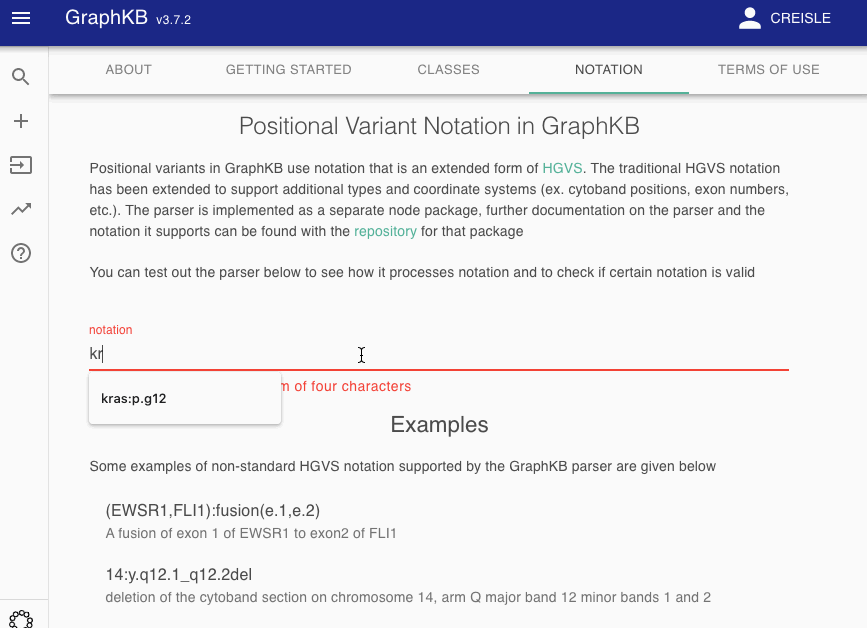
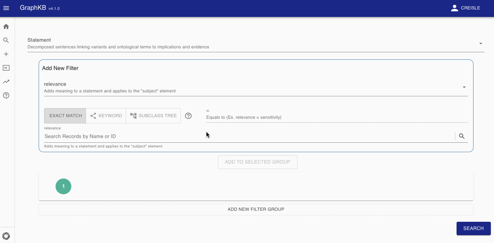

# GraphKB Client


This repository is part of the [platform for oncogenomic reporting and interpretation](https://github.com/bcgsc/pori).

The GraphKB client is the front-end web client for the GraphKB project. It is built
using `React.js` and `webpack`. Linting is done with `eslint`, and follows a modified
version of the Airbnb style guide. The full guide for developers can be found
[here](docs/CONTRIBUTING.md).

- [Getting Started](#getting-started)
  - [Install](#install)
- [Examples](#examples)
  - [Notation Parser](#notation-parser)
  - [Query Builder](#query-builder)

## Getting Started

### Install

First clone the repository locally and checkout the development branch

```bash
git clone https://github.com/bcgsc/pori_graphkb_client.git
cd pori_graphkb_client
git checkout master
```

Next install the project dependencies using npm

```bash
npm install
```

Start the development server

```bash
npm start
```

## Examples

The GraphKB Client contains views for allowing users to both add and edit data in GraphKB as well
as documentation about the app itself. Some examples of various sections are given below.

### Notation Parser

This is part of the app documentation at `/about/notation`. It is an interactive view which allows
the user to familiarized themselves with the notation used in GraphKB which is an extension of HGVS
notation.



### Query Builder

Advaced queries can be built using the query builder. The example below shows a user searching for
drug sensitivity statements loaded from [CIViC](https://civicdb.org).


